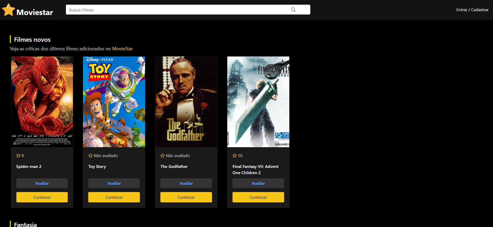

# PJ - Moviestar
 Este projeto é uma rede social quase completa. O objeto de estudo aqui é a conexão de PHP + BD, PHP e a WEB, Regras de negócio complexas e múltiplas integrações. Este projeto se trata da seção 19 do curso PHP: Do zero a Maestria

 ## Como está o projeto?
 O projeto está totalmente funcional e responsivo. Caso queira experimentar, basta baixar e executar (Seguindo as instruções da Seção: Rodar o projeto). É possível se cadastrar, adicionar filmes, adicionar reviews entre otras funções. Conta com diversas telas, e muita programação e lógica. Conta também com autenticação de usuário, codificação de senha e etc. Além disso, o projeto está totalmente responsivo

### Capturas de tela
Home:


Login/Registro:


Usuário:


Dashboard:


## Rodar o projeto
Caso queira rodar o projeto em sua máquina local será necessário o Apache e o Banco de Dados Mysql. Recomendo a instalação do **Laragon**, que é um pacote de instalaçaões que traz esses 2 serviços. Basta jogar o projeto na pasta *www* e colocar o banco de dados base disponível na pasta Database no servidor local (Pode-se fazer isso pelo PHPMyadmin). OBS: Talvez seja necessário mudar o arquivo connect.php deixando a variável password vazia.

```php
   $pass = "";
```

 ## Stack
 As tecnologias usadas nesse projeto são:
 * HTML
 * CSS
 * PHP
 * Bootstrap
 * Bootstrap Icons
 * MySQL
 
 Acesse o repositório do curso citado clicando [Aqui](https://github.com/JoaopedroSassi/PHP_Zero_Maestria-HC)
